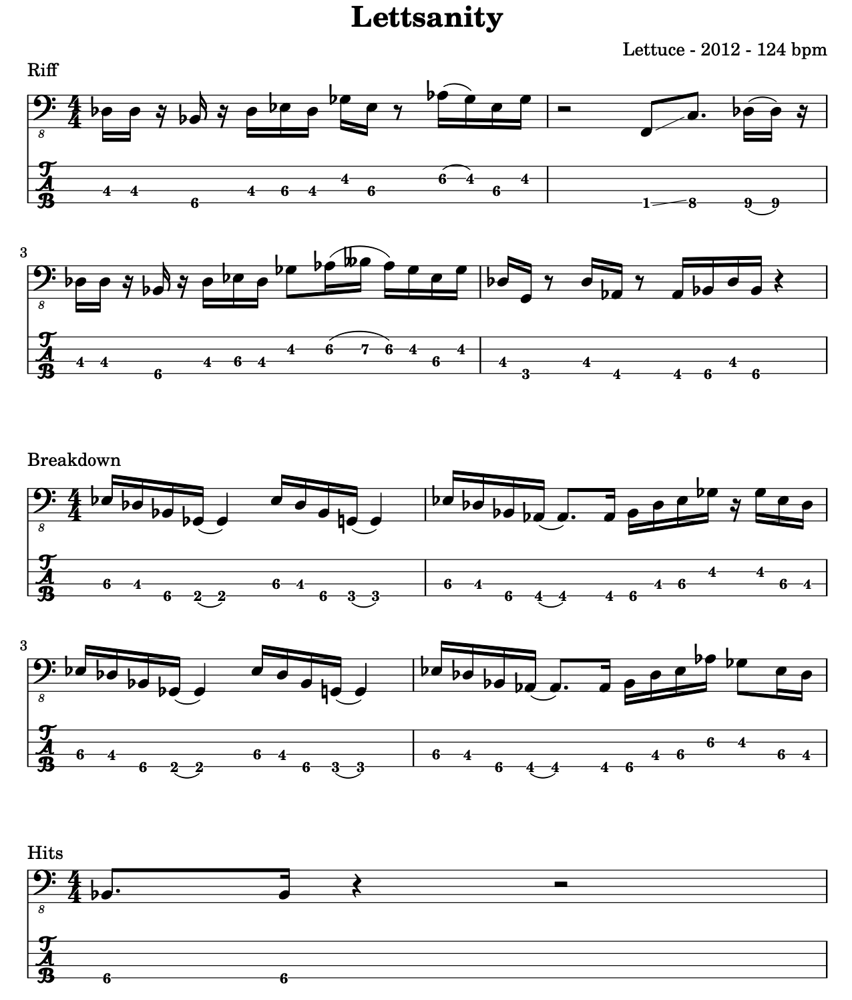

# Fakebook
A fakebook to help me with the practice of music, namely reading sheets, writing, listening to new songs and working on improvisation.

- [Lettsanity - Lettuce](./src/Lettsanity.ly)
- [When You Gonna Learn - Jamiroquai](./src/WhenYouGonnaLearn.ly)

## Build 

```shell
make nameOfpart
open build/nameOfPart
```

## An example of output 


